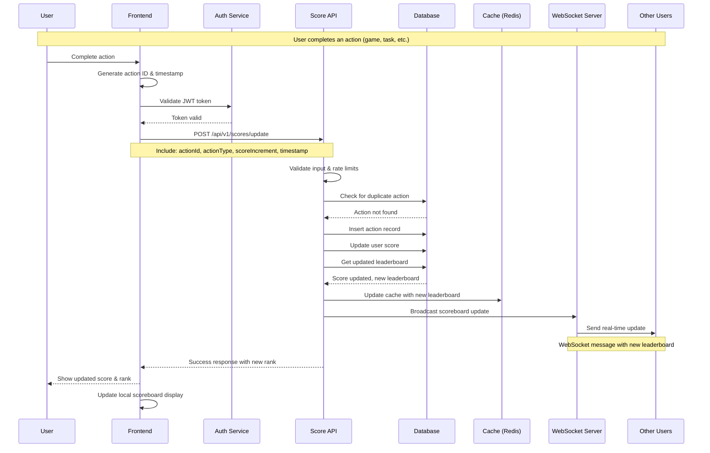
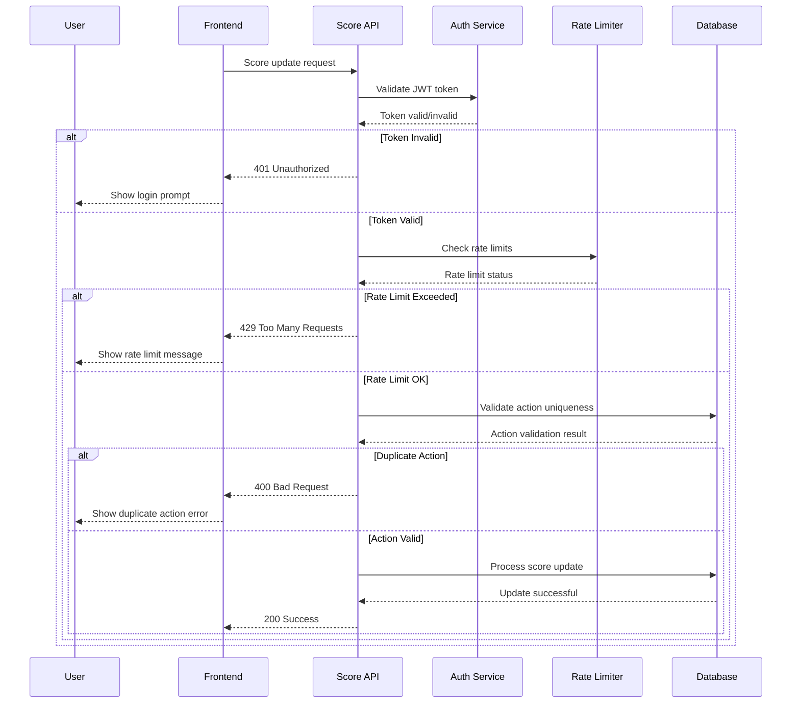
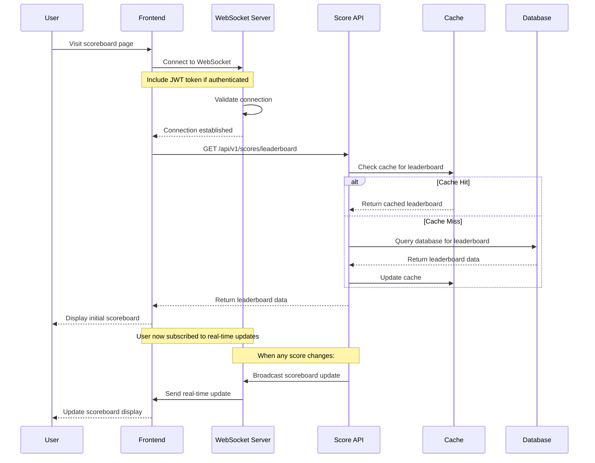

# Live Scoreboard API Service Module Specification

## Overview

Live Scoreboard API Service - handles real-time score updates and top 10 leaderboard. Built it to be secure and fast since most leaderboards are either slow or easy to hack.

## Business Requirements

1. **Scoreboard Display**: Top 10 user scores
2. **Live Updates**: Real-time updates (no page refresh)
3. **Score Incrementation**: Users can increase scores via actions
4. **Security**: No cheating allowed
5. **Performance**: Fast updates, low latency

## Technical Architecture

### Core Components

- **Score Management Service**: Handles score calculations and updates
- **Authentication Service**: Validates user identity and permissions
- **Real-time Communication**: WebSocket/Server-Sent Events for live updates
- **Data Persistence**: Database layer for score storage and retrieval
- **Rate Limiting**: Prevents abuse and ensures fair usage

### Technology Stack

- **Runtime**: Node.js + TypeScript (use what you know)
- **Framework**: Express.js or Fastify
- **Database**: PostgreSQL + Redis
- **Real-time**: Socket.io
- **Auth**: JWT tokens
- **Rate Limiting**: Redis-based

## API Endpoints Specification

### 1. Score Update Endpoint

```http
POST /api/v1/scores/update
```

**Purpose**: Update user score after action completion

**Request Headers**:
```
Authorization: Bearer <jwt_token>
Content-Type: application/json
```

**Request Body**:
```json
{
  "actionId": "string",
  "actionType": "string",
  "scoreIncrement": "number",
  "timestamp": "ISO8601_string"
}
```

**Response**:
```json
{
  "success": true,
  "data": {
    "userId": "string",
    "newScore": "number",
    "rank": "number",
    "message": "Score updated successfully"
  }
}
```

**Security Requirements**:
- Valid JWT token required
- Rate limiting: max 10 requests per minute per user
- Action validation to prevent duplicate submissions

### 2. Scoreboard Retrieval Endpoint

```http
GET /api/v1/scores/leaderboard
```

**Purpose**: Retrieve current top 10 scores

**Request Headers**:
```
Authorization: Bearer <jwt_token> (optional for public view)
```

**Response**:
```json
{
  "success": true,
  "data": {
    "leaderboard": [
      {
        "rank": 1,
        "userId": "string",
        "username": "string",
        "score": "number",
        "lastUpdated": "ISO8601_string"
      }
    ],
    "lastUpdated": "ISO8601_string"
  }
}
```

### 3. Real-time Scoreboard Updates

```http
WebSocket: /ws/scores
```

**Purpose**: Subscribe to real-time scoreboard updates

**Connection Requirements**:
- Valid JWT token for authenticated users
- Public access for anonymous users (read-only)

**Message Format**:
```json
{
  "type": "scoreboard_update",
  "data": {
    "leaderboard": [...],
    "timestamp": "ISO8601_string"
  }
}
```

## Security Implementation

Most important part - don't let people cheat the leaderboard.

### Authentication & Authorization

1. **JWT Token Validation**
   - Token expiration: 15 minutes
   - Refresh token: 7 days
   - Secure cookie storage with httpOnly flag

2. **Action Verification**
   - Unique action ID validation
   - Timestamp validation (prevent replay attacks)
   - Action type verification against allowed actions

3. **Rate Limiting**
   - Score updates: 10 per minute per user
   - API calls: 100 per minute per IP
   - WebSocket connections: 5 per IP

### Data Integrity

1. **Score Validation**
   - Positive integer validation
   - Maximum score limit per action
   - Duplicate action prevention

2. **Input Sanitization**
   - SQL injection prevention
   - XSS protection
   - Input length and format validation

## Database Schema

### Users Table
```sql
CREATE TABLE users (
  id UUID PRIMARY KEY,
  username VARCHAR(50) UNIQUE NOT NULL,
  email VARCHAR(255) UNIQUE NOT NULL,
  created_at TIMESTAMP DEFAULT NOW(),
  updated_at TIMESTAMP DEFAULT NOW()
);
```

### Scores Table
```sql
CREATE TABLE scores (
  id UUID PRIMARY KEY,
  user_id UUID REFERENCES users(id),
  score BIGINT NOT NULL DEFAULT 0,
  last_updated TIMESTAMP DEFAULT NOW(),
  created_at TIMESTAMP DEFAULT NOW()
);
```

### Actions Table
```sql
CREATE TABLE actions (
  id UUID PRIMARY KEY,
  user_id UUID REFERENCES users(id),
  action_id VARCHAR(255) NOT NULL,
  action_type VARCHAR(100) NOT NULL,
  score_increment INTEGER NOT NULL,
  created_at TIMESTAMP DEFAULT NOW(),
  UNIQUE(user_id, action_id)
);
```

## Flow of Execution Diagrams

### Main Flow: User Action Completion and Score Update



### Security Validation Flow



### Real-time Scoreboard Update Flow



## Implementation Guidelines

### Error Handling
- Consistent error format
- Proper HTTP status codes
- Good error messages for debugging

### Logging
- Structured logging with correlation IDs
- Audit trail for score changes
- Performance metrics

### Performance Considerations
- Redis cache for leaderboard data
- Cache invalidation on score updates
- Database query optimization
- Horizontal scaling with load balancers
- Database connection pooling
- Async processing for non-critical operations

## Testing Strategy

- **Unit Tests**: Score logic, auth middleware, validation
- **Integration Tests**: API endpoints, database, WebSocket
- **Load Tests**: High-frequency updates, concurrent users

## Deployment & Monitoring

- Environment-specific config files
- Secure secret management
- Health check endpoints
- Performance monitoring
- Database query performance
- Error rate tracking
- Real-time user metrics

## Additional Comments for Improvement

Some ideas to make this better. Some are important, others are nice-to-have.

### 🚀 High Priority Improvements

#### 1. Performance Optimizations
- **Database Indexing Strategy**:
  ```sql
  -- Composite index for leaderboard queries
  CREATE INDEX idx_scores_user_score ON scores(user_id, score DESC);
  
  -- Index for action deduplication
  CREATE INDEX idx_actions_user_action ON actions(user_id, action_id);
  
  -- Partial index for active users
  CREATE INDEX idx_scores_active ON scores(score) WHERE score > 0;
  ```

- **Multi-Level Caching**:
  ```typescript
  // L1: In-memory cache (fastest)
  const memoryCache = new Map<string, any>();
  
  // L2: Redis cache (distributed)
  const redisCache = new Redis();
  
  // L3: Database (persistent)
  const database = new Database();
  ```

#### 2. Security Enhancements
- **Multi-Factor Authentication (MFA)**:
  ```typescript
  interface MFAConfig {
    enabled: boolean;
    methods: ('sms' | 'email' | 'totp')[];
    gracePeriod: number; // seconds
  }
  ```

- **Adaptive Rate Limiting**:
  ```typescript
  interface AdaptiveRateLimit {
    baseLimit: number;
    burstLimit: number;
    decayRate: number;
    userTrustScore: number; // Adjust limits based on user behavior
  }
  ```

#### 3. Scalability Improvements
- **Load Balancer Configuration**:
  ```yaml
  # nginx.conf
  upstream scoreboard_backend {
    least_conn; # or ip_hash for session consistency
    server backend1:3000;
    server backend2:3000;
    server backend3:3000;
  }
  ```

- **Microservices Architecture**:
  ```
  scoreboard-service/
  ├── auth-service/          # Authentication & authorization
  ├── score-service/         # Score management
  ├── leaderboard-service/   # Leaderboard calculations
  ├── notification-service/  # Real-time updates
  └── analytics-service/     # Data analytics
  ```

### 🔧 Medium Priority Improvements

#### 4. Monitoring & Observability
- **Structured Logging with Correlation IDs**:
  ```typescript
  interface LogEntry {
    correlationId: string;
    userId: string;
    action: string;
    timestamp: string;
    metadata: Record<string, any>;
    performance: {
      responseTime: number;
      databaseQueries: number;
      cacheHits: number;
    };
  }
  ```

- **Advanced Health Checks**:
  ```typescript
  interface HealthCheck {
    status: 'healthy' | 'degraded' | 'unhealthy';
    checks: {
      database: HealthStatus;
      redis: HealthStatus;
      externalServices: HealthStatus[];
    };
    metrics: {
      responseTime: number;
      errorRate: number;
      activeConnections: number;
    };
  }
  ```

#### 5. API Enhancement
- **GraphQL Implementation**:
  ```graphql
  type Query {
    leaderboard(
      limit: Int = 10
      offset: Int = 0
      timeRange: TimeRange
      category: String
    ): LeaderboardResponse
    
    userScore(userId: ID!): UserScore
    scoreHistory(userId: ID!, days: Int): [ScoreEntry]
  }
  
  type Subscription {
    leaderboardUpdates: LeaderboardUpdate
    userRankChange(userId: ID!): RankChange
  }
  ```

### 🌟 Low Priority Improvements

#### 6. Advanced Features
- **Achievement System**:
  ```typescript
  interface Achievement {
    id: string;
    name: string;
    description: string;
    criteria: AchievementCriteria;
    rewards: Reward[];
    rarity: 'common' | 'rare' | 'epic' | 'legendary';
  }
  ```

- **Social Features**:
  - Friend leaderboards
  - Challenge invitations
  - Team competitions

#### 7. Analytics & Insights
- **User Behavior Analytics**:
  ```typescript
  interface UserAnalytics {
    userId: string;
    sessionDuration: number;
    actionsPerSession: number;
    peakActivityHours: number[];
    retentionRate: number;
    churnRisk: 'low' | 'medium' | 'high';
  }
  ```

### 🛠️ Implementation Roadmap

Break it down into phases - doing everything at once usually fails.

#### Phase 1 (Weeks 1-4): Core Improvements
- [ ] Database indexing and query optimization
- [ ] Enhanced caching strategy
- [ ] Improved rate limiting
- [ ] Basic monitoring implementation

#### Phase 2 (Weeks 5-8): Security & Performance
- [ ] Advanced authentication features
- [ ] Performance monitoring and alerting
- [ ] Load testing and optimization
- [ ] Security audit and hardening

#### Phase 3 (Weeks 9-12): Scalability & Features
- [ ] Horizontal scaling implementation
- [ ] Microservices architecture
- [ ] Advanced analytics
- [ ] API enhancements

#### Phase 4 (Weeks 13-16): Advanced Features
- [ ] Gamification elements
- [ ] Social features
- [ ] Machine learning integration
- [ ] Advanced reporting

### 📊 Success Metrics for Improvements

#### Performance Metrics
- **Response Time**: Target < 50ms (95th percentile)
- **Throughput**: Support 100,000+ concurrent users
- **Cache Hit Rate**: Target > 95%
- **Database Query Time**: Target < 10ms

#### Security Metrics
- **Security Incidents**: Target 0 per month
- **Failed Authentication Attempts**: Monitor and alert on spikes
- **Rate Limit Violations**: Track and analyze patterns

## Dependencies

- User authentication service
- Database service (PostgreSQL)
- Cache service (Redis)
- Message queue service (optional)
- Action verification service
- User management service
- Analytics service

## Success Metrics

- **Performance**: API response time < 100ms
- **Reliability**: 99.9% uptime
- **Security**: Zero unauthorized score modifications
- **Scalability**: Support 10,000+ concurrent users

---

*That's it. Use this as a starting point and adapt to what your team needs.*
